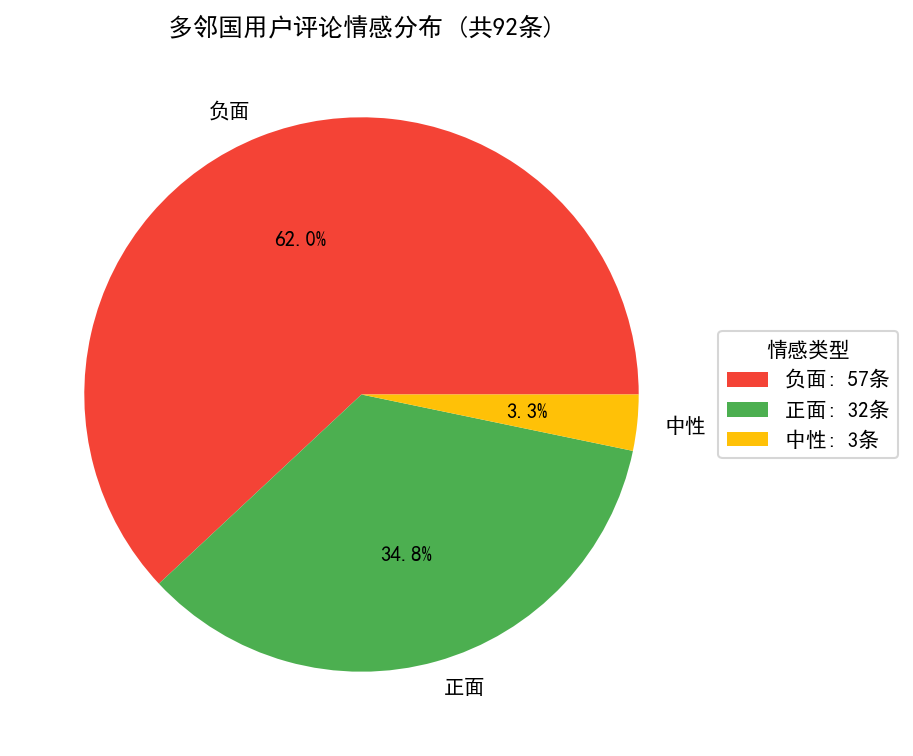
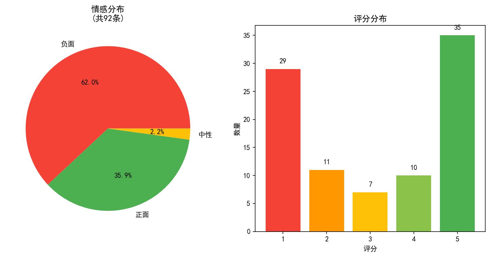

# 多邻国用户评论情感分析器

> 一款可以自动检测用户需求、App评分，以及找出最应该优先处理问题的AI工具

## 项目简介

手动阅读成百上千条App Store评论费时费力，且容易遗漏关键用户声音。本项目通过调用大模型API，自动分析用户评论，帮助产品经理快速发现用户痛点和优先级。

### 解决的问题
- 人工阅读评论内容费时费力
- 检测结果不准确、不全面
- 无法快速发现用户真实需求

### 我的方案
- AI自动分析，2分钟完成人工2小时工作
- 输出情感分布、评分分布、紧急问题TOP5
- 提供数据驱动的产品改进建议

## 技术栈

| 类别 | 技术 |
|------|------|
| 编程语言 | Python 3.12 |
| 数据处理 | Pandas |
| AI模型 | DeepSeek API |
| 可视化 | Matplotlib |
| 开发环境 | Visual Studio Code |

## 核心发现（基于92条真实评论）

### 情感分布
| 情感 | 占比 |
|------|------|
| 负面 | 62.0% |
| 正面 | 35.9% |
| 中性 | 2.1% |

### 原始评分分布
| 评分 | 数量 | 占比 |
|------|------|------|
| 5星 | 35条 | 38.0% |
| 4星 | 10条 | 10.9% |
| 3星 | 7条 | 7.6% |
| 2星 | 11条 | 12.0% |
| 1星 | 29条 | 31.5% |

### 用户最满意的点
- 免费功能可以轻松入门
- 在学习过程中有游戏化乐趣
- 可以学习的内容很多

### 紧急问题实例（需要尽快解决的问题）
1. 没办法进入应用，出现闪退，并且进入后持续性卡顿
2. 进行比拼时，到最后一步出现bug，无法继续正常比拼，只能选择投降
3. 付费后无法正常使用App
4. 自动扣费后，联系客服和平台互相推卸责任

## 如果我是多邻国的产品经理

| 优先级 | 改进建议 |
|--------|---------|
| P0 | 经常性维护系统稳定性，减少出现卡顿、闪退的情况 |
| P0 | 及时修复bug，并给予受影响的用户相应补偿 |
| P0 | 开辟自动续费退款专席，核实后合理退款 |
| P1 | 更新请假功能，让特殊情况的用户可以当天请假，不影响连续学习记录 |
| P2 | 持续关注多邻国App的评论，根据用户意见做出相应反馈 |

## 演示截图





## 环境配置

### 1. 获取 DeepSeek API Key
- 访问 https://platform.deepseek.com/
- 注册账号 → API Keys → 创建新密钥
- 新用户赠送 500 万 tokens（免费）

### 2. 设置环境变量

**Windows（命令提示符）：**
```cmd
set DEEPSEEK_API_KEY=你的key


Windows（PowerShell）：
$env:DEEPSEEK_API_KEY="你的key"

Mac / Linux：
export DEEPSEEK_API_KEY="你的key"

3. 安装依赖
pip install pandas openai matplotlib

4. 运行分析
python analyze_reviews.py
数据来源
App Store 中国区评论：11条

七麦数据平台：81条

合计：92条有效评论

项目结构
duolingo-review-analyzer/
├── analyze_reviews.py      # 主程序
├── README.md               # 项目说明
├── .gitignore              # Git忽略文件
├── 完整分析结果.csv         # 分析结果数据
├── 情感分布饼图.png         # 饼图
└── 分析图表.png            # 组合图表

联系方式
GitHub：facai111293

项目地址：https://github.com/facai111293/duolingo-review-analyzer